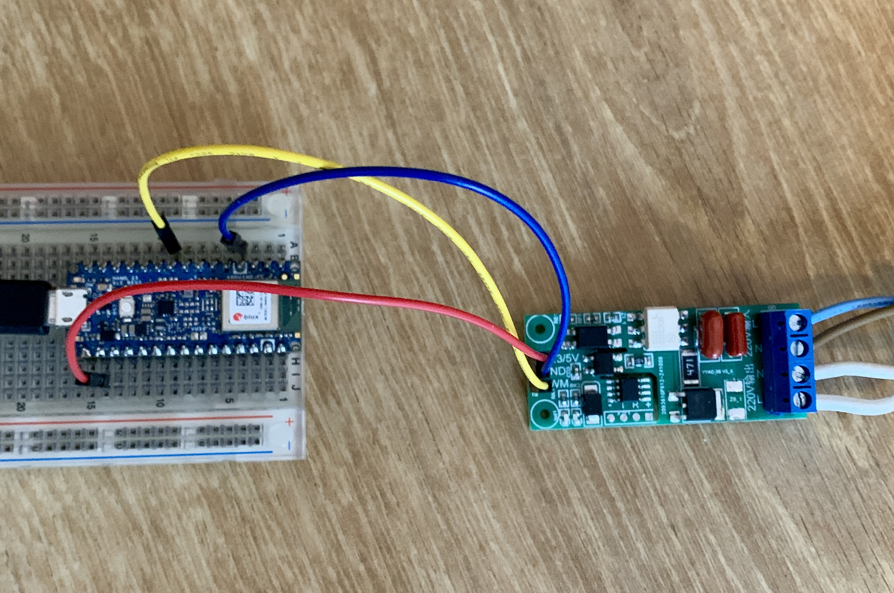

# PulseFlow
Control the speed of a cooling fan with your heart rate while riding/using your indoor trainer.

Image: Prototype, work in progress

## Description

**PulseFlow** is a small Arduino sketch that connects via BLE to a HR fitness sensor like those from Garmin, Wahoo and others. The fan is connected to a PWM controllable AC dimmer or a dimmer that exposes 2 pins: Output Zerocross detection, input triac trigger. These AC dimmers can be sourced from marketplaces like AliExpress.

## Warning
BE AWARE THAT YOU'LL BE WORKING WITH DEADLY LIVE VOLTAGES. TAKE APPROPRIATE SAFETY MEASURES WHEN CONNECTING PARTS AND WHILE USING THE DEVICE YOU CREATED. 

## Limitations

+ Your HR sensor must allow for multiple BLE connections as your trainer software/device will possiby have to connect to the sensor too using BLE (Garmin HR-Dual sensor supports multiple BLE connections)
+ Sensor pairing is hardcoded, see the sourcecode
+ Use a fan that has no electronic speed control of it's own.
+ The HR to fan speed mapping is hardcoded, see the sourcecode
+ In case of a PWM controlled dimmer:
  + The PWM signal is available on pin D6 (Arduino numbering)
  + Code to generate the PWM is Nano 33 BLE specific
+ In case of zero-cross/triac trigger dimmer:
  + Pin 2 (Arduino numbering) is used to detect the zero-crossing (interupt)
  + The triac trigger pulse is available on pin D6 (Arduino numbering)
  + The delay implementation between the zero-crossing and the triactrigger is Nano 33 BLE specific
+ As the NANO is a 3.3V device the AC dimmer you use must be 3.3v tolerable/compatible (or add levelshifting)
+ Installing the various parts in a metal of shielded housing can influense the BLE RF signal

## Possible enhancements

+ Do away with hardcoded pairing
+ Create an UI (e.g. a 2-Line display and rotary encoder) for pairing, map settings. 
+ Alternate fan speed mapping methods (speed, power,...).

## Change Log

### in development (main)
+ code cleanup
+ added battery level chec

### v1.1.0
+ added code for 2nd type of dimmer

### v1.0.0
+ Initial release

